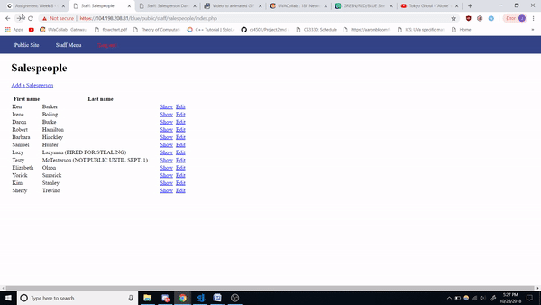
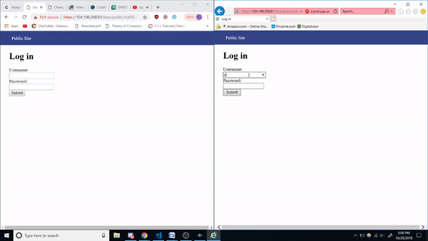
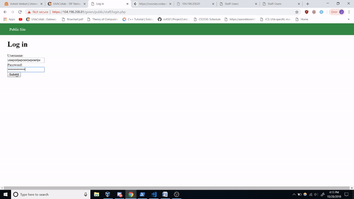
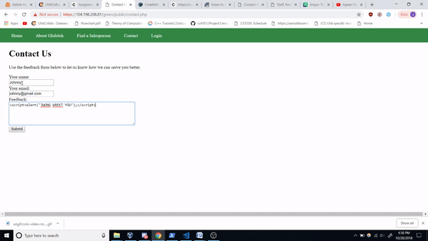
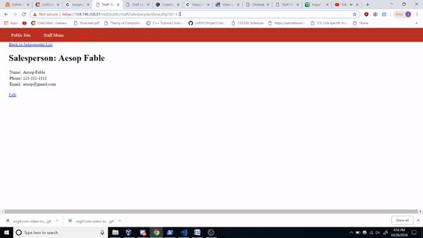
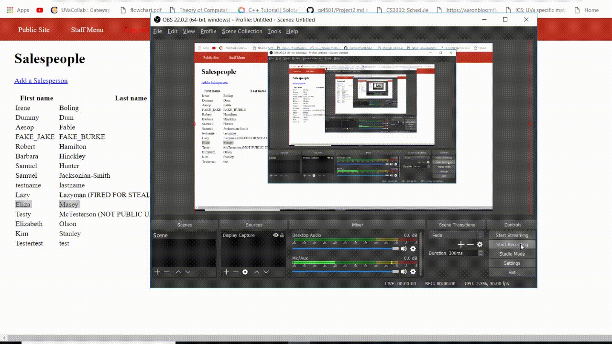

# codepath-week8

# Project 8 - Pentesting Live Targets

Time spent: **X** hours spent in total

> Objective: Identify vulnerabilities in three different versions of the Globitek website: blue, green, and red.

The six possible exploits are:
* Username Enumeration
* Insecure Direct Object Reference (IDOR)
* SQL Injection (SQLi)
* Cross-Site Scripting (XSS)
* Cross-Site Request Forgery (CSRF)
* Session Hijacking/Fixation

Each version of the site has been given two of the six vulnerabilities. (In other words, all six of the exploits should be assignable to one of the sites.)

## Blue

### Vulnerability #1: SQL Injection
To discover this exploit, ti required little more than brute force. One of the hints provided you the SQL code necessary ' OR SLEEP(5)=0--'.Using Burp and trial & error, it was found to be on the blue site.  The sites require an id to determine which salesperson to show. So simply changing the id a bit to take in our example SQL code below

https://104.198.208.81/blue/public/staff/salespeople/show.php?id='OR SLEEP(5)=0--'

We manage to perform a sql injection, making the page take longer to render completely. 

### Vulnerability #2: Session Hijacking/Fixation
For this exploit, we first open two different browsers. I used Chrome and IE.  On both sites, we go to the login screen(https://104.198.208.81/blue/public/staff/login.php) and the provided Codepath PHP tool (https://104.198.208.81/blue/public/hacktools/change_session_id.php). We used IE to login. Then by going to the PHP tool on the IE, we can grab the PHPSESSIONID, copy and paste it into the Codepath PHP tool on Chrome and click change. Now we can access the blue site on chrome despite never actually logging.

## Green

### Vulnerability #1: Username Enumeration
When you put an arbitrary username that isn’t an actual user, you get a simple Log in was unsuccessful. However, if you use a username that exists but wrong password, you get a bolded Log in was unsuccessful. This allows anyone to figure out if a username is valid or not.

### Vulnerability #2: Cross-Site Scripting
For the feedback page of the Green site, you could easily do some cross site scripting. Simply entering any javascript such as  into the feedback input box would allow you to cause javascript to run whenever anyone goes to see all feedback. Rather than printing a message, a malicious user could do so much more.

## Red

### Vulnerability #1: Insecure Direct Object Reference
For the red site, it’s possible for you to access Salesperson without being logged in.  This is because to reference salesperson, they use id which they public show on the url. In my case, even if you aren’t logged in, you could just do something like
 https://104.198.208.81/red/public/salesperson.php?id=13
To grab information about the salesperson who has an id of 13 whether ro not you are logged in.

### Vulnerability #2: Cross-Site Request Forgery
I worked on this part of the assignment last. Therefore, it was easy to pinpoint which site had this weakness. I submitted a feedback that provided a link that would change a user's information. Using some social engineering, I can see how an uninformaed user amy click a malign link to trigger something terrible. In this case, my think simply sent a form to edit a user's lastname to be funny.

## Notes

Describe any challenges encountered while doing the work

Letting anyone change or delete the login credentials prevented me from loggin in to do lab occassionally.
